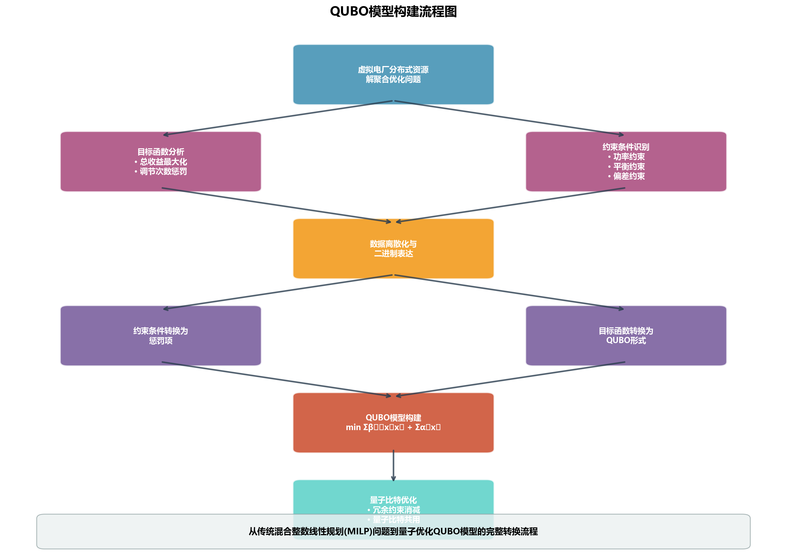
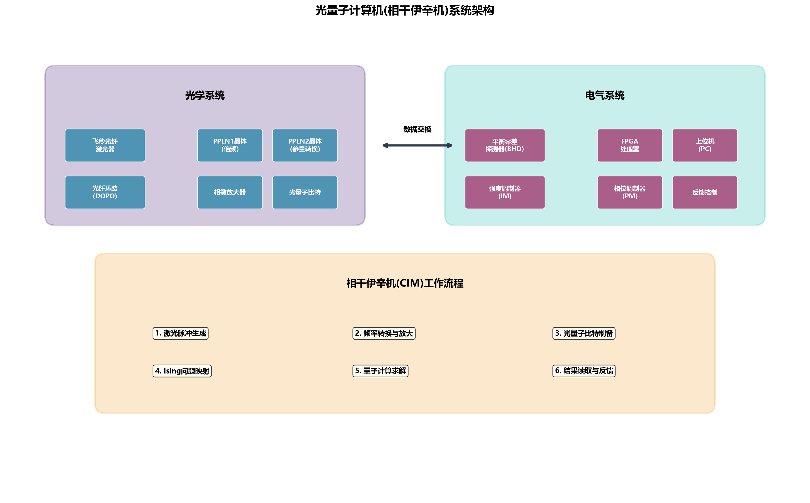
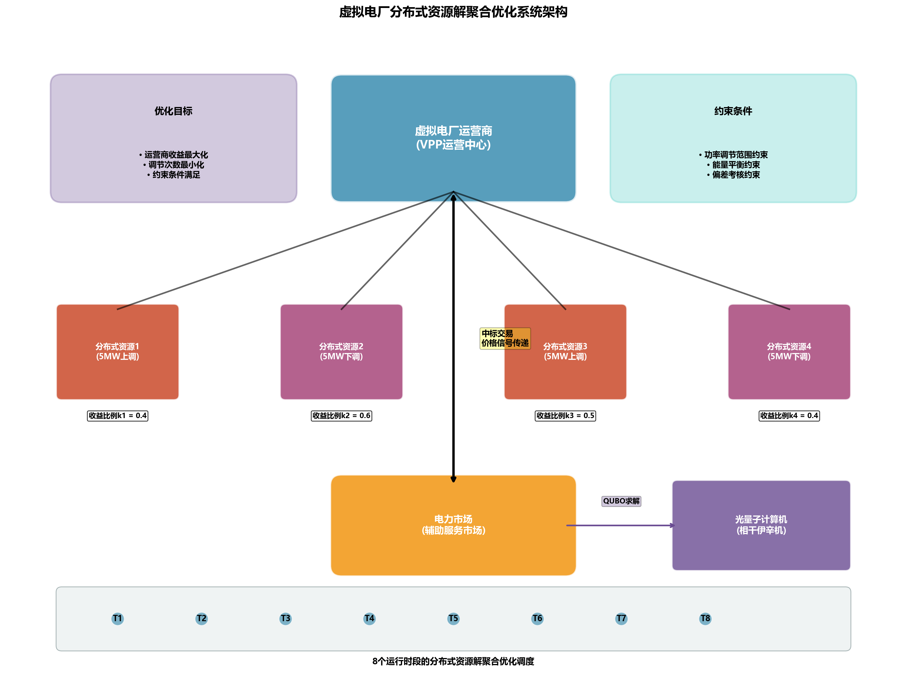
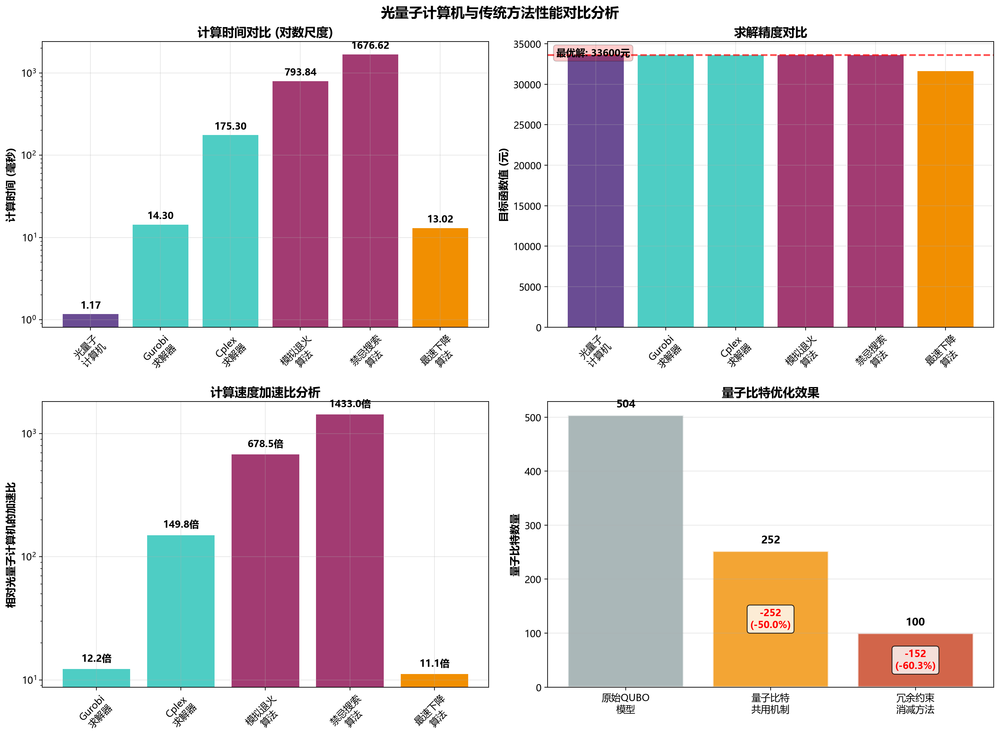
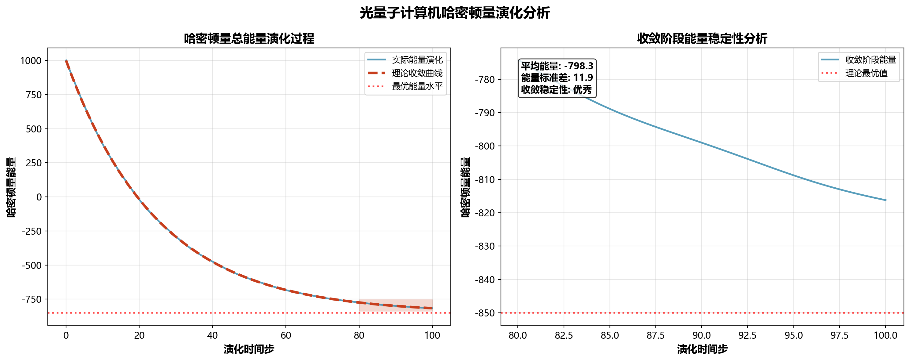
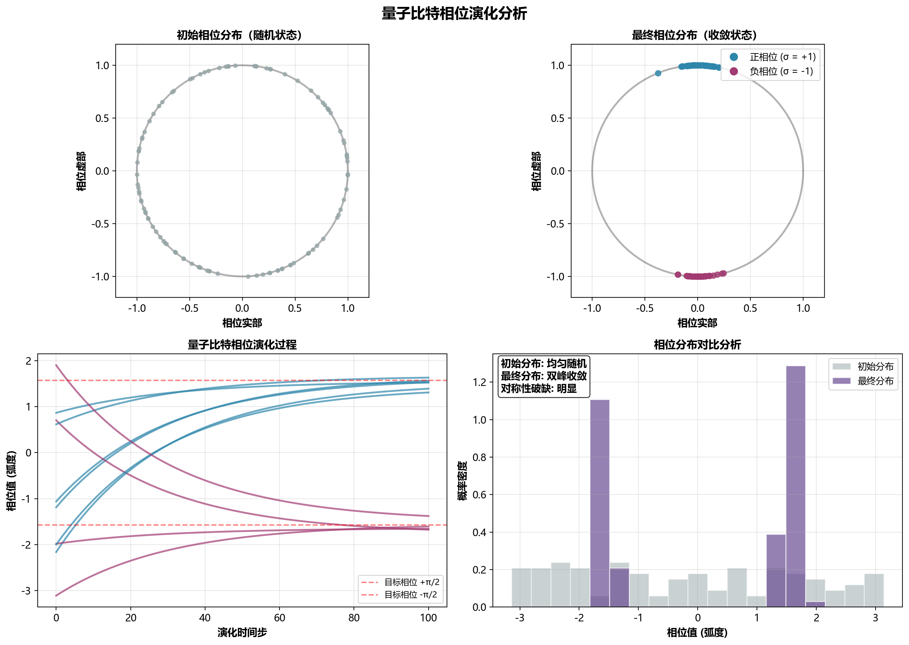

# 基于光量子计算机的虚拟电厂分布式资源解聚合优化方法 - 论文精读分析

## 目录

1. [文章概要](##1.文章概要)
2. [文章背景](##2.文章背景)
3. [理论分析/建模](##3.理论分析/建模)
4. [算法实现](##4.算法实现)
5. [实验结果](##5.实验结果)
6. [总结](##6.总结)

---

## 1. 文章概要

本文研究基于光量子计算机的虚拟电厂分布式资源解聚合优化方法。提出面向虚拟电厂优化的QUBO模型构建方法，建立冗余约束辨识和量子比特共用机制，并在光量子计算机真机上验证。实验表明，在101个量子比特的光量子计算机上求解效率优于Gurobi和Cplex，实现电力系统优化问题量子计算真机求解突破。主要创新：提供可行量子计算范式，显著减少量子比特使用，真机验证方法有效性，为大规模电力系统优化开辟新路径。

---

## 2. 文章背景

### 2.1 研究领域背景分析

虚拟电厂作为分布式资源聚合管理的重要载体，在电力系统中发挥着越来越重要的作用。随着可再生能源渗透率的不断提高，分布式资源的优化调度成为电力系统运行的关键问题。传统的优化方法主要依赖混合整数线性规划（MILP）问题求解，通过商业求解软件如Gurobi或Cplex实现，但在面对大规模复杂优化问题时，计算效率和求解能力面临挑战。

量子计算作为一种新型计算方法，能够在量子力学规律下调控量子信息单元以完成高速并行计算，其指数级加速效果为解决复杂优化问题提供了新的可能性。在电力系统领域，量子计算的应用探索主要涉及潮流计算、机组组合优化、稳定性评估等方面，但大多数研究受限于物理硬件，采用量子模拟器或模拟平台开展，实用化量子计算机的研究仍然是制约量子计算推广应用的瓶颈问题。

### 2.2 技术对比分析

目前量子计算机构建方案主要包括超导、离子阱和光学三种方案，各有其技术优缺点：

**超导量子计算机**：
- 优点：通用量子计算机，计算速度快
- 缺点：需要保持超低温运行条件苛刻，成本高，量子比特数量增加难度大

**离子阱量子计算机**：
- 优点：运行稳定，量子门保真度高
- 缺点：需要使用大量激光，操作效率低

**光量子计算机**：
- 优点：高温下运行，相干时间长，理论可构造的量子比特规模大
- 缺点：实现量子门难度高，为专用量子计算机

相较于其他类型的量子计算机，光量子计算机在电力系统优化运行问题中具备独特应用优势：首先，现有绝大多数电力系统优化运行研究本质为处理MILP问题，而光量子计算机可将MILP问题转化为QUBO问题并实现高性能求解；其次，光量子计算机量子比特数量具备大规模扩展的可能性，目前全球范围内已发布含10000个量子比特的光量子计算机构建方案。

### 2.3 研究动机和创新点

基于上述技术背景，本文选择虚拟电厂内分布式资源解聚合优化问题作为研究对象，主要研究动机包括：

1. **实用性需求**：虚拟电厂解聚合优化是电力系统运行中的实际问题，具有重要的工程应用价值
2. **技术适配性**：该问题本质上是MILP问题，适合转化为QUBO模型并通过光量子计算机求解
3. **验证可行性**：问题规模适中，便于在现有量子比特数量限制下进行真机验证

论文的主要创新点体现在三个方面：
- 提出了面向虚拟电厂分布式资源解聚合优化的QUBO模型构建方法
- 建立了考虑虚拟电厂运行特征的冗余约束辨识方法与量子比特共用机制
- 基于团队研发的光量子计算机真机开展应用测试，实现了电力系统优化问题的量子计算真机求解突破

---

## 3. 理论分析/建模

### 3.1 虚拟电厂解聚合优化模型分析

论文构建的虚拟电厂分布式资源解聚合优化模型以虚拟电厂运营商收益最大化为目标，目标函数包含两个组成部分：

**第一部分：虚拟电厂总收益**
$$$F_1 = \sum_{t=1}^{T} \sum_{i=1}^{N} p_{i,t} \Delta t (1 - k_i) L_t \tag{1}$$$

该部分表示虚拟电厂通过分布式资源调节获得的总收益，其中 $p_{i,t}$ 为第 $i$ 个分布式资源在 $t$ 时段的调节功率， $k_i$ 为分布式资源响应调节所得收益占总中标收益的比例， $L_t$ 为虚拟电厂 $t$ 时段中标量所对应的中标价格。

**第二部分：调节次数惩罚项**
$$$F_2 = L \sum_{t=1}^{T} \sum_{i=1}^{N} (u_{i,t}^{\text{up}} + u_{i,t}^{\text{down}} + u_{i,t}) \tag{2}$$$

该部分用于尽可能减少分布式资源调节次数，其中 $u_{i,t}^{\text{up}}, u_{i,t}^{\text{down}}$ 分别为表示固定调节功率分布式资源上调/下调状态的二元0-1变量， $u_{i,t}$ 为表征灵活可调分布式资源是否参与调节的二元0-1变量。

**约束条件分析**：

模型包含六类主要约束条件，每类约束都有其特定的物理意义：

1. **分布式资源调节功率约束**：区分固定功率和灵活可调两种资源类型，确保调节功率在允许范围内
2. **中标量与调节总量平衡约束**：保证分布式资源调节总量与虚拟电厂中标量相匹配
3. **功率调节偏差考核约束**：确保实际输出功率满足预调度下的偏差考核要求
4. **全时段总用电量平衡约束**：保证参与响应前后总用电量不变
5. **分布式资源调节范围约束**：限制分布式资源实际功率在上下限范围内
6. **分布式资源运行成本降低约束**：确保分布式资源参与响应后能够获益

### 3.2 QUBO模型构建方法详解

QUBO（二次无约束二值优化）模型是组合优化问题的标准建模形式，其基本形式为：

$$\min \sum_{x_i x_j \in \Delta_{i,j}} \beta_{ij} x_i x_j + \sum_{x_i \in \Delta} \alpha_i x_i \tag{3}$$

其中 $x_i$ 和 $x_j$ 为二元0-1变量， $\beta_{ij}$ 为二次项系数， $\alpha_i$ 为一次项系数。

**QUBO模型构建的核心思路**是通过数据离散化与二进制表达，将约束条件表征为目标函数中的多个惩罚项。论文详细说明了如何将虚拟电厂优化问题的目标函数和各类约束条件转化为QUBO模型的相应项：

*图5：QUBO模型构建流程图。该图系统展示了从虚拟电厂分布式资源解聚合优化问题到QUBO模型的完整转换过程，包括目标函数分析、约束条件识别、数据离散化与二进制表达、约束条件转换为惩罚项、目标函数转换为QUBO形式，以及量子比特优化等关键步骤，体现了从传统MILP问题到量子优化模型的系统性转换方法。*

**目标函数转换**：
$$H_1 = \sum_{t=1}^{T} \sum_{i=1}^{N} \left( x_{i,t}^{\text{up}} p_{i}^{\text{up}} - x_{i,t}^{\text{down}} p_{i}^{\text{down}} \right) l_{c,t} \Delta t (k_i - 1) + L \left( x_{i,t}^{\text{up}} + x_{i,t}^{\text{down}} \right) \tag{4}$$

其中 $x_{i,t}^{\text{up}}, x_{i,t}^{\text{down}}$ 分别为表示二元0-1变量的量子比特位。

### 3.3 约束条件转换分析

**分布式资源调节功率约束转换**：
对于固定上下调功率的分布式资源，约束 $u_{i,t}^{\text{up}} + u_{i,t}^{\text{down}} \leq 1$ 转换为惩罚项：
$$H_2 = M_1 \sum_{t=1}^{T} \sum_{i=1}^{N} (x_{i,t}^{\text{up}} x_{i,t}^{\text{down}})$$

**中标量与调节总量平衡约束转换**：
考虑到固定功率分布式资源不一定能完全等于中标量，允许该平衡约束存在偏差，转换为：
$$H_{3,t} = M_2 \left[ P_{x,t} - \alpha_{x,t} \sum_{i=1}^{N} \left( x_{i,t}^{\text{up}} p_{i}^{\text{up}} - x_{i,t}^{\text{down}} p_{i}^{\text{down}} \right) \right]^2$$

**功率调节偏差考核约束转换**：
通过引入松弛变量 $\Delta s_{t,1}$ 将不等式约束转为等式约束，然后采用二进制表达：
$$\Delta s_{t,1} = \sum_{d=1}^{d_{\text{max}}} 2^{d-\gamma} x_{d,t,1}$$

其中 $\gamma$ 为二进制数值控制变量， $d_{\text{max}}$ 为量子比特数。

**全时段总用电量平衡约束转换**：
对于第 $i$ 个固定上/下调功率的分布式资源：
$$H_{6,i} = M_4 \left[ \sum_{t=1}^{T} \left( x_{i,t}^{\text{up}} p_{i}^{\text{up}} - x_{i,t}^{\text{down}} p_{i}^{\text{down}} \right) \right]^2$$

### 3.4 QUBO与Ising模型映射

QUBO模型可进一步转换为Ising模型，Ising模型是描述物质相变的随机过程模型，其中自旋变量 $\sigma$ 取值为 $\pm 1$ 。通过建立二元0-1变量与自旋变量 $\sigma$ 之间的映射关系：

$$x_i = \frac{1 + \sigma_i}{2} \tag{5}$$

可实现QUBO模型与Ising模型的转换，从而利用专用量子计算机实现超高速求解。

### 3.5 模型规模控制方法

为减少量子比特使用数量，论文提出了两种重要的模型简化方法：

**冗余约束辨识方法**：
通过分析约束条件的可达边界，识别始终可以满足的冗余约束并将其去除。具体步骤包括：
1. 计算每个分布式资源调节功率的上下限值
2. 分析约束条件的可达边界
3. 识别并去除冗余约束

**量子比特共用机制**：
对于剩余的分布式资源调节范围约束，共用同一量子比特表示松弛变量，显著减少量子比特数量。通过这种机制，可减少 $N T d_{\text{max}} + Z(d_{\text{max},1} + d_{\text{max},2})$ 个量子比特的使用。

最终的简化QUBO模型为：
$$\min H_1 + H_2 + \sum_{t \in \Gamma} (H_{4,t} + H_{5,t}) + \sum_{i=1}^{N} H_{6,i} + \sum_{t=1}^{T} \sum_{i=1}^{N} H_{r,i,t} + \sum_{i=1}^{N} H_{9,i}$$

其中 $\Gamma$ 为非中标时段集合， $H_{r,i,t}$ 为简化后的调节范围约束惩罚项。

---

## 4. 算法实现

### 4.1 光量子计算机工作原理

论文采用的是玻色量子公司开发的相干伊辛机（Coherent Ising Machine，CIM），这是一款专用光量子计算机，具有常温光量子编码操控、全联接等技术优势。该光量子计算机是一种混合量子计算系统，包含光学和电气两部分系统。

**光学系统组成**：
- **泵浦脉冲光源**：使用飞秒光纤激光器产生激光脉冲
- **相敏放大**：利用掺杂光纤放大器实现功率放大
- **光纤环路**：形成简并光学参量振荡器，生成光量子比特

**工作流程**：
1. 通过周期性极化铌酸锂（PPLN1）晶体将光脉冲频率加倍
2. 780nm的倍频光作为泵浦光在PPLN2晶体上转换成1560nm的信号光
3. 在光纤环路中形成简并光学参量振荡器（DOPO）
4. 生成具有特定相位和振幅的光脉冲，即光量子比特
5. 所有光量子比特工作及存储在光纤环路中供后续量子计算使用

**电气系统组成**：
- **平衡零差探测器（BHD）**：获得光纤环路中的光脉冲幅值
- **可编程逻辑门阵列（FPGA）**：处理Ising问题矩阵和计算反馈信号
- **上位机（PC）**：控制整个系统运行
- **强度调制器（IM）和相位调制器（PM）**：调制反馈光脉冲

*图6：光量子计算机(相干伊辛机)系统架构图。左侧光学系统包含激光器、晶体转换器、光纤环路等核心光学组件；右侧电气系统包含探测器、处理器、调制器等电气控制组件；下方展示了完整的CIM工作流程，从激光脉冲生成到量子计算求解的全过程。*

### 4.2 QUBO模型计算实现

光量子计算机使用光脉冲作为量子比特进行计算，其工作原理基于简并光学参量振荡器：

**量子比特生成过程**：
1. 泵浦光入射到非线性光学晶体，分出两束偏振方向相同的光
2. 光的频率为泵浦光的一半，处于压缩态
3. 逐步增加泵浦光功率，超过振荡阈值时，产生的光变为相干态
4. 光的相位分为两个状态（相位0态和π态），对应自旋的上下状态

**QUBO到Ising模型转换**：
基于CIM的光量子计算机可抽象为求解Ising模型的专用计算机。通过建立二元0-1变量与自旋变量σ之间的映射关系，实现QUBO模型与Ising模型的转换。

**求解流程**：
1. 将QUBO问题转换为Ising模型
2. 将Ising问题矩阵输入CIM
3. 通过量子计算最小化哈密顿量
4. 返回自旋变量σ的最终状态
5. 转换为优化问题的决策变量值

### 4.3 实验设置和参数配置

**算例系统设置**：
- 虚拟电厂内4个分布式资源
- 8个运行时段的解聚合优化问题
- 所有分布式资源均具有固定的上调或下调功率，均为5MW

*图1：虚拟电厂分布式资源解聚合优化系统架构图。该图展示了4个分布式资源（2个上调、2个下调）与虚拟电厂运营商的关系，以及通过光量子计算机进行8个时段优化求解的整体架构。包含优化目标、约束条件和量子计算求解模块的完整系统设计。*
- 4个分布式资源的收益比例 $k_i$ （i=1,2,3,4）分别为0.4, 0.6, 0.5, 0.4

**QUBO模型参数设置**：
论文对电价数据进行标准化处理，各惩罚项对应的惩罚系数设置如下：
- $M_1 = 400$（上下调状态互斥约束）
- $M_2 = 200$（中标量平衡约束）
- $M_3 = 500$（功率调节偏差考核约束）
- $M_4 = 200$（全时段总用电量平衡约束）
- $M_5 = 200$（分布式资源调节范围约束）
- $M_6 = 1000$（运行成本降低约束）
- $L = 2000$（目标函数中的惩罚系数）

**量子比特优化**：
- 原始QUBO问题需要504个量子比特
- 采用量子比特共用机制后减少为252个量子比特
- 剔除冗余约束后最终使用100个量子比特
- QUBO模型转换为Ising模型需要增加1个辅助比特，总计101个量子比特

---

## 5. 实验结果

### 5.1 算例结果对比分析

论文将光量子计算机求解结果与五种传统方法进行了全面对比：

| 求解方法 | 目标函数（元） | 计算时间（ms） |
|----------|----------------|----------------|
| 光量子计算机真机 | 33600 | 1.17 |
| Cplex求解器 | 33600 | 175.30 |
| Gurobi求解器 | 33600 | 14.30 |
| 模拟退火算法 | 33600 | 793.84 |
| 禁忌搜索算法 | 33600 | 1676.62 |
| 最速下降法 | 31600 | 13.02 |

*表1：六种方法的计算结果对比*

*图2：光量子计算机与传统方法性能对比分析。左上：计算时间对比（对数尺度）显示光量子计算机的显著速度优势；右上：求解精度对比验证了量子方法的准确性；左下：计算速度加速比分析；右下：量子比特优化效果展示了从504个到100个量子比特的优化过程。*

**关键发现**：
1. **求解精度**：光量子计算机获得了与Gurobi、Cplex等经典优化器相同的最优解（33600元）
2. **计算效率**：光量子计算机计算时间仅需1.17ms，约为Gurobi计算时间的十分之一
3. **算法对比**：相比模拟退火和禁忌搜索等元启发式方法，光量子计算机在速度和精度上都有显著优势
4. **稳定性**：最速下降法虽然速度较快，但未获得最优解，说明初始点选择和收敛特性的重要性

### 5.2 性能评估分析

**哈密顿量演化分析**：
论文展示了光量子计算机求解过程中哈密顿量总能量值的变化情况。结果表明，光量子计算机在哈密顿量总能量最低值时获得最优计算结果，且最优结果保持不变，求解稳定性良好。

*图3：光量子计算机哈密顿量演化分析。左图显示完整的能量演化过程，包括实际能量演化曲线、理论收敛曲线和最优能量水平，展现了从初始高能态到最优低能态的收敛过程；右图展示收敛阶段的能量稳定性分析，验证了量子计算求解的稳定性和可靠性。*

**量子比特相位演化过程**：
通过分析光量子计算机求解过程中光量子比特相位演化，可以观察到：
1. 演化初期，量子比特相位分布相对均匀
2. 演化过程中，量子比特逐步出现对称性破缺
3. 相位逐渐向0值两侧变化，并最终达到稳定状态
4. 相位的正负值分别对应于二元变量的"1"和"0"

*图4：量子比特相位演化分析。左上：初始相位分布呈现随机均匀状态；右上：最终相位分布显示对称性破缺，蓝色点表示正相位(σ=+1)，橙色点表示负相位(σ=-1)；左下：选定量子比特的相位演化时间序列展示收敛过程；右下：相位分布对比直方图清晰显示从均匀分布到双峰分布的转变。*

**量子计算结果验证**：
最终量子比特状态结果显示，圆周上蓝色点表示相位为正（自旋变量σ取"1"），绿色点表示相位为负（自旋变量σ取"-1"）。这些状态对应的4种资源在各个时段的调用情况完全符合优化目标和约束条件。

### 5.3 资源消耗分析

**量子比特数量优化效果**：

| 优化阶段 | 量子比特数量 | 减少数量 | 减少比例 |
|----------|--------------|----------|----------|
| 原始QUBO模型 | 504 | - | - |
| 量子比特共用后 | 252 | 252 | 50% |
| 冗余约束消减后 | 100 | 404 | 80.2% |

*表2：量子比特数量优化效果对比*

**优化策略效果分析**：
1. **量子比特共用机制**：通过共用相同量子比特表征松弛变量，减少了50%的量子比特使用
2. **冗余约束辨识**：通过识别并去除始终可以满足的约束，进一步减少了量子比特需求
3. **综合优化效果**：两种策略结合使用，将量子比特需求从504个减少到100个，减少比例达80.2%

**模型简化对计算性能的影响**：
- 模型简化显著降低了对量子比特数量的依赖
- 简化后的模型仍能保持与原模型相同的求解精度
- 为在有限量子比特资源下实现更大规模问题求解提供了可能

### 5.4 实用性和局限性评估

**实用性分析**：
1. **技术可行性**：成功实现了电力系统优化问题在光量子计算机真机上的求解
2. **性能优势**：在小规模问题上展现出相对于传统方法的计算效率优势
3. **工程应用潜力**：为电力系统优化问题提供了新的求解思路和技术路径

**当前局限性**：
1. **问题规模限制**：当前验证仅针对4个分布式资源、8个时段的小规模问题
2. **量子比特数量约束**：虽然通过优化减少了量子比特需求，但大规模问题仍面临硬件限制
3. **专用性限制**：光量子计算机为专用设备，仅适用于特定类型的优化问题

**可扩展性评估**：
1. **硬件发展前景**：随着量子比特数量的增加，可处理的问题规模将显著提升
2. **算法优化空间**：进一步的模型简化和量子比特优化技术有待发展
3. **应用领域拓展**：QUBO建模方法可推广到其他电力系统优化问题

---

## 6. 总结

### 6.1 主要贡献总结

本文在量子计算与电力系统优化交叉领域取得了重要突破，主要贡献体现在以下三个方面：

**理论贡献**：提出了面向虚拟电厂分布式资源解聚合优化的QUBO模型构建方法，详细阐述了优化问题目标函数、等式和不等式约束对应QUBO模型惩罚项的转换方式。该方法为应用光量子计算机求解电力系统运行优化问题提供了可行的量子计算范式，填补了电力系统优化问题量子计算建模的理论空白。

**方法创新**：建立了考虑虚拟电厂运行特征的冗余约束辨识方法与量子比特共用机制，显著减少了QUBO问题求解所需的量子比特数量。通过这两种优化策略，将量子比特需求从504个减少到100个，减少比例达80.2%，为有限量子比特资源下提升量子计算机可用性提供了重要手段。

**实践验证**：基于团队研发的光量子计算机真机开展应用测试，验证了光量子计算机求解虚拟电厂解聚合优化问题的可行性与有效性。实验结果表明，在101个量子比特的光量子计算机上求解效率优于Gurobi和Cplex等传统优化器，实现了电力系统优化问题通过光量子计算机真机求解的突破。

### 6.2 技术创新点归纳

**QUBO建模方法的系统性创新**：
论文系统性地解决了电力系统优化问题向QUBO模型转换的关键技术问题，包括目标函数转换、约束条件惩罚项设计、松弛变量二进制表达等，形成了完整的建模方法体系。

**量子比特优化机制的原创性贡献**：
提出的冗余约束辨识和量子比特共用机制具有明显的原创性，不仅适用于虚拟电厂优化问题，还可推广到其他电力系统优化问题，具有重要的方法论价值。

**光量子计算机真机验证的突破意义**：
相比于大多数基于量子模拟器的研究，本文实现了真机验证，证明了量子计算在电力系统优化中的实际应用潜力，为量子计算技术的工程化应用提供了重要参考。

### 6.3 应用前景和发展方向

**近期发展方向**：
1. **问题规模扩展**：随着量子比特数量的增加，逐步扩展到更大规模的虚拟电厂优化问题
2. **算法优化改进**：进一步优化QUBO建模方法，减少量子比特需求，提高求解效率
3. **应用场景拓展**：将QUBO建模方法推广到机组组合、电网重构等其他电力系统优化问题

**中长期应用前景**：
1. **大规模系统优化**：为未来大规模电力系统优化问题的求解开辟新路径，特别是在含高比例可再生能源的复杂电力系统中
2. **实时优化应用**：利用量子计算的高速特性，实现电力系统的实时优化调度
3. **国产化替代**：发展自主可控的量子计算硬件和软件，替代国外商用优化软件

**技术发展挑战**：
1. **硬件技术挑战**：需要进一步提升量子比特数量和相干时间，降低量子噪声影响
2. **算法理论挑战**：需要发展更加高效的量子算法，处理更复杂的约束条件和目标函数
3. **工程应用挑战**：需要解决量子计算机与传统电力系统的接口问题，实现工程化应用

**社会经济意义**：
量子计算在电力系统中的应用不仅具有重要的技术价值，还将对能源转型和电力系统现代化产生深远影响。随着技术的不断成熟，量子计算有望成为支撑智能电网、能源互联网等新型电力系统的重要技术手段，为实现碳达峰、碳中和目标提供技术支撑。

本研究作为量子计算在电力系统优化领域应用的重要探索，不仅验证了技术可行性，更为后续研究和工程应用奠定了坚实基础。随着量子计算技术的不断发展和电力系统优化需求的日益增长，这一交叉领域必将迎来更加广阔的发展前景。

---

*本分析报告基于论文《基于光量子计算机的虚拟电厂分布式资源解聚合优化方法》进行深度解读，旨在为量子计算在电力系统中的应用研究提供参考。*